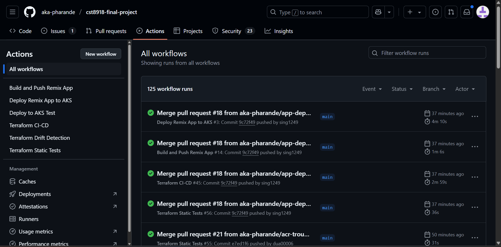
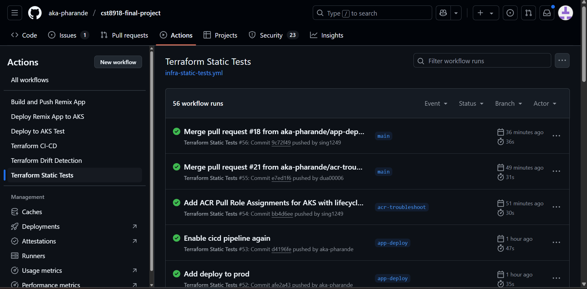
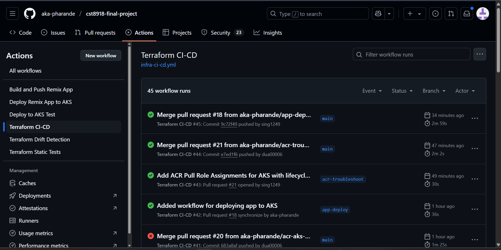
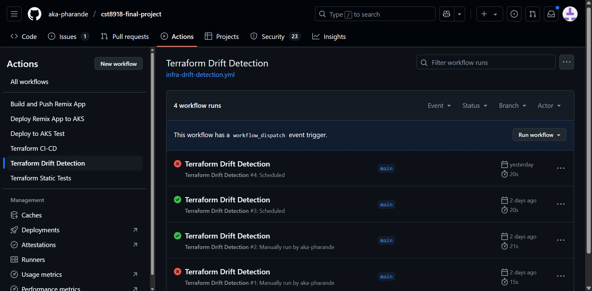
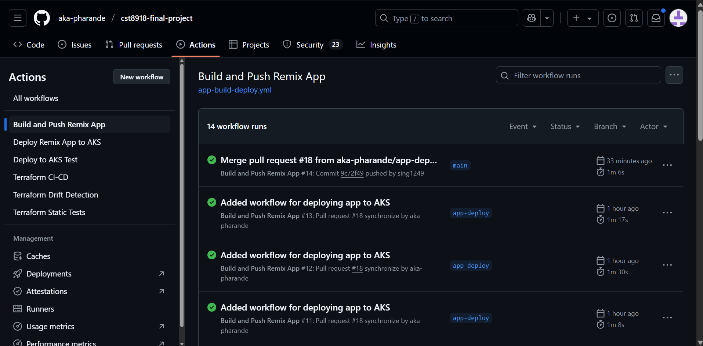
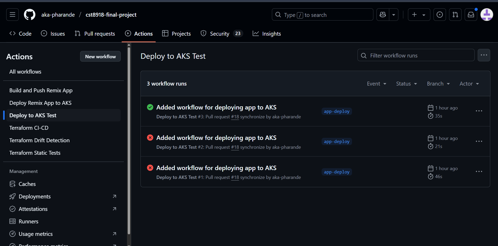
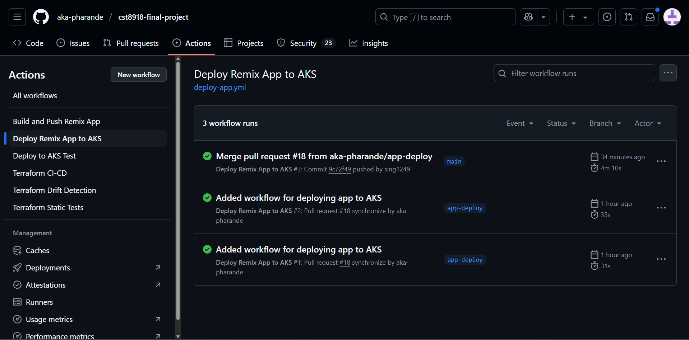

# CST8918 Final Project – Terraform, Azure AKS & GitHub Actions

## Team Members

| Name               | GitHub Username    | College Username | GitHub Profile                                   |
|--------------------|--------------------|------------------|--------------------------------------------------|
| Talwinder Singh     | `sing1249`         | sing1249         | [github.com/sing1249](https://github.com/sing1249) |
| Aakanksha Pharande  | `aka-pharande`     | phar0053         | [github.com/aka-pharande](https://github.com/aka-pharande) |
| Vrinda Dua          | `dua00006`         | dua0006          | [github.com/dua00006](https://github.com/dua00006) |

## 🌦️ Remix Weather Application Deployment

This project demonstrates the use of Infrastructure as Code (IaC) using **Terraform**, Azure cloud infrastructure, and **GitHub Actions** for CI/CD workflows. It extends the Week 3 Remix Weather App by containerizing and deploying it to **Azure Kubernetes Service (AKS)** using **Azure Container Registry (ACR)** and **Azure Cache for Redis** for performance optimization.


## GitHub Actions Workflow Screenshots

### Overview: All Workflows
This screenshot shows a snapshot of all the completed GitHub Actions workflows configured in the repository.



---

### Static Infrastructure Tests
This workflow runs Terraform formatting, validation, and `tfsec` checks on every push to any branch.



---

### Terraform Plan & Lint
Executes `terraform plan` and `tflint` on pull requests to `main`.



---

### Infrastructure Drift Detection
Runs `terraform plan` regularly to detect drift between actual infrastructure and Terraform code.



---

### Build & Push to ACR
Builds the Remix Weather App Docker image and pushes it to Azure Container Registry when application code changes.



---

### Deploy to Test & Prod AKS Clusters
Deploys the weather app to AKS test environment on pull requests, and to production on merges.



---

### Deploy App Workflow Run
A GitHub Actions workflow that applies infrastructure changes automatically on merge to `main`.




## Infrastructure Highlights

- **Resource Group**: `cst8918-final-project-group-11`

- **Virtual Network**: `fp11-vnet` (`10.0.0.0/14`)
  - `prod`: `10.0.0.0/16`
  - `test`: `10.1.0.0/16`
  - `dev`: `10.2.0.0/16`
  - `admin`: `10.3.0.0/16`

- **AKS Clusters**:
  - **Test**: 1 node (`Standard_B2s`)
  - **Prod**: Autoscaling enabled (1–3 nodes)

- **Redis**:
  - Managed Azure Cache for Redis instances for both test and prod environments

- **ACR**:
  - Docker image registry used for storing container images (`fp11weatheracr`)

## CI/CD Pipelines

CI/CD workflows are configured in `.github/workflows`:

-  **Static Infrastructure Tests**:  
  Runs `terraform fmt`, `terraform validate`, and `tfsec` on **all pushes** to any branch.

-  **Plan & TFLint**:  
  Executes `terraform plan` and `tflint` on **pull requests to the `main` branch**.

-  **Terraform Apply**:  
  Applies changes automatically on **push to `main`**.

-  **App Build & Push to ACR**:  
  Builds and pushes the Docker image for the Remix Weather App to ACR on **pull requests to `main`**.

-  **Deploy App to AKS**:  
  - **Test Environment**: On **pull request to `main`**  
  - **Production Environment**: On **merge to `main`**

## 📁 Project Structure

```bash
📦 cst8918-final-project/
├── .github/workflows/                  # CI/CD GitHub Actions workflows
│   ├── app-build-deploy.yml
│   ├── deploy-app.yml
│   ├── infra-ci-cd.yml
│   ├── infra-drift-detection.yml
│   └── infra-static-tests.yml
├── application/                        # Remix Weather App & Kubernetes manifests
│   ├── app/
│   │   ├── api-services/
│   │   ├── routes/
│   │   ├── utils/
│   │   ├── entry.client.tsx
│   │   ├── entry.server.tsx
│   │   └── root.tsx
│   ├── api-services/                  
│   └── k8s/
│       ├── a01_deployment.yaml
│       ├── a01_namespace.yaml
│       ├── a01_secrets.yaml
│       └── a01_service.yaml
├── infra/                              # Terraform infrastructure as code
│   ├── az-federated-credential-params/
│   │   ├── branch-main.json
│   │   ├── production-deploy.json
│   │   └── pull-request.json
│   ├── tf-app/                         # Terraform entry point
│   │   ├── main.tf
│   │   ├── variables.tf
│   │   ├── outputs.tf
│   │   ├── terraform.tf
│   │   ├── tf-app.plan
│   │   └── .terraform/
│   ├── tf-backend/                    # Backend config for remote state
│   │   ├── backend.tf
│   │   ├── main.tf
│   │   ├── outputs.tf
│   │   ├── terraform.tf
│   │   └── variables.tf
│   └── modules/                       # Reusable Terraform modules
│       ├── aks/
│       │   ├── main.tf
│       │   ├── outputs.tf
│       │   └── variables.tf
│       ├── acr/
│       │   ├── main.tf
│       │   ├── outputs.tf
│       │   └── variables.tf
│       └── network/
│           ├── main.tf
│           ├── outputs.tf
│           └── variables.tf
├── public/                             # App public assets
│   └── favicon.ico
├── remix.config.js
├── remix.env.d.ts
├── tsconfig.json
├── Dockerfile
├── package.json
├── package-lock.json
└── README.md
```
